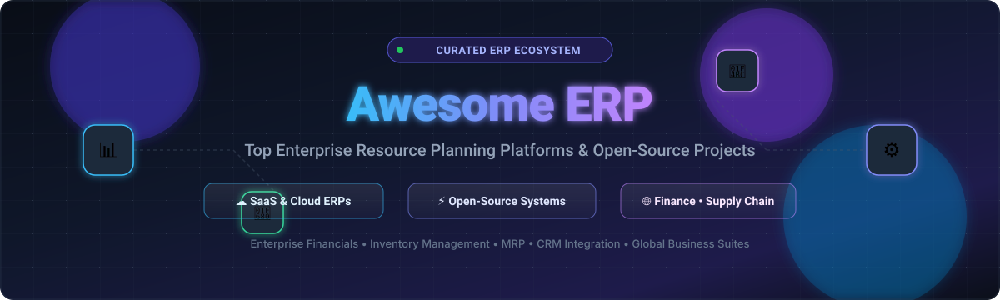
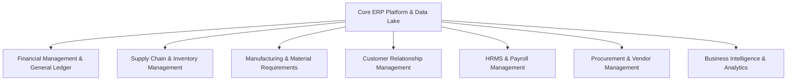

  

  
  
  
  
  
  

---

# 🚀 Awesome ERP

> **A curated directory of top Enterprise Resource Planning (ERP) SaaS platforms and open-source GitHub projects for modern businesses, finance teams, supply chains, manufacturing, and developers.**

Enterprise Resource Planning (**ERP**) systems unite core business operations—including financial accounting, general ledger, accounts payable/receivable, supply chain management (SCM), inventory and warehouse management (WMS), material requirements planning (MRP), customer relationship management (CRM), human resources (HRMS), and procurement—into a synchronized system of record.

Whether you are evaluating tier-1 cloud SaaS vendors or self-hosting an extensible open-source codebase for full data sovereignty, this repository tracks the best tools across the ERP landscape.

---

## 📑 Table of Contents

- [☁️ SaaS & Hosted ERP Platforms](#️-saas--hosted-erp-platforms)
- [⚡ Open-Source GitHub Projects](#-open-source-github-projects)
- [🧩 ERP Architectural Capabilities & Modules](#-erp-architectural-capabilities--modules)
- [💡 How to Choose an ERP System](#-how-to-choose-an-erp-system)
- [🤝 How to Contribute](#-how-to-contribute)
- [📈 Star History](#-star-history)
- [📜 Disclaimer](#-disclaimer)

---

## ☁️ SaaS & Hosted ERP Platforms

The table below details leading cloud and hosted ERP SaaS solutions, sorted in descending order by **Company Size (Market Capitalization / Valuation / Revenue)**. Specific entry-tier starting prices and exact free tier/trial limits are documented for accurate budget planning.

| Platform | Description & Key Strengths | Company Size (Valuation / Revenue) | Starting Pricing | Free Tier / Free Trial Limits |
| :--- | :--- | :--- | :--- | :--- |
| **[Microsoft Dynamics 365 Business Central](https://www.microsoft.com/en-us/dynamics-365/products/business-central)** | Comprehensive cloud ERP integrated seamlessly with Microsoft 365, Teams, Excel, and Power Automate; ideal for SMBs and mid-market organizations. | **~$3.1 Trillion Market Cap** (Microsoft) / **~$245B+ Annual Revenue** | Starts at **$80/user/month** (Essentials tier; Team Members at $8/user/month, Premium at $110/user/month). | **30-day free trial** (extendable for an additional 30 days; full access to Cronus sample database and test company setup). |
| **[Oracle NetSuite](https://www.netsuite.com/)** | Unified multi-tenant cloud ERP suite covering global financials, revenue recognition, inventory, multi-subsidiary consolidation (OneWorld), and CRM. | **~$380B+ Market Cap** (Oracle) / **~$53B+ Annual Revenue** | Starts at **$999/month** base platform fee + **$99/user/month** for full-access named user licenses. | **14-day free trial / guided demo sandbox** via authorized partners (pre-configured workflows; no open self-service sign-up). |
| **[SAP S/4HANA](https://www.sap.com/products/erp/s4hana.html)** | Market-leading enterprise ERP engine powered by SAP HANA in-memory database, delivering real-time analytics, AI insights, and deep industry-specific processes. | **~$260B+ Market Cap** (SAP SE) / **~$34B+ Annual Revenue** (€31.2B) | Starts at **~$180–$217/user/month** (GROW with SAP Public Edition base tier; typically 15-user minimum commitment). | **30-day free trial** (pre-configured cloud sandbox with sample enterprise data and guided business flows; no custom data import). |
| **[Sage Intacct](https://www.sage.com/en-us/sage-intacct/)** | AICPA-preferred cloud financial management and core accounting platform specializing in multi-entity consolidations, dimensional reporting, and SaaS metrics. | **~$14B+ Market Cap** (The Sage Group plc) / **~$2.9B Annual Revenue** | Starts at **~$750–$1,000/month** (~$9,000–$12,000/year base package including core financials and initial named user). | **30-day free trial / interactive test environment** via sales or partner request (pre-loaded demo datasets and financial reports). |
| **[IFS Cloud](https://www.ifs.com/)** | Specialized ERP, Enterprise Asset Management (EAM), and Field Service Management (FSM) platform tailored for aerospace, defense, energy, and construction. | **~$10B+ Valuation** (backed by EQT & Hg) / **~$1.1B+ Annual Revenue** | Starts at **~$110–$250/user/month** (or asset-based pricing for Industrial AI solutions depending on operational scope). | **Custom proof-of-concept sandbox** on request via sales evaluation (no open self-service free trial). |
| **[Odoo (Enterprise / Online)](https://www.odoo.com/)** | Modular, user-friendly business software covering CRM, sales, manufacturing MRP, double-entry accounting, point-of-sale, and e-commerce. | **~$5.0B Valuation** (€4.5B) / **~$400M+ ARR** | Starts at **$24.90/user/month** (Standard plan billed annually) or **$31.10/user/month** (monthly); Custom plan from **$37.40/user/month**. | **Free forever plan** on "One App Free" tier for unlimited users (limited strictly to 1 installed app on Odoo Online SaaS); **15-day free trial** for full multi-app suite. |
| **[Epicor ERP (Kinetic)](https://www.epicor.com/)** | Deeply specialized manufacturing and distribution ERP offering advanced shop-floor control, job costing, supply chain traceability, and CPQ engines. | **~$4.7B Valuation** (CD&R) / **~$1.0B+ Annual Revenue** | Starts at **~$100–$150/user/month** (plus **~$1,500/month** base platform fee; typically 5-user minimum commitment). | **Guided interactive product tour & partner demo** on request (no public self-service free trial; evaluation environments provisioned via sales). |
| **[Infor CloudSuite](https://www.infor.com/)** | Vertically customized industry suites (Industrial, Food & Beverage, Healthcare, Distribution) featuring built-in micro-vertical capabilities and AWS hosting. | **~$3.5B+ Annual Revenue** (Infor / Koch Industries parent ~$125B+ revenue) | Starts at **~$150–$225/user/month** (depending on vertical CloudSuite edition; multi-user annual agreement required). | **Interactive guided tour & evaluation environment** on request through Infor partners (no standalone open free trial). |
| **[Acumatica](https://www.acumatica.com/)** | Modern cloud-native ERP known for its consumption-based pricing model (unlimited users), flexible deployment options, and open REST API architecture. | **~$2.0B+ Valuation** (backed by EQT) / **~$200M+ ARR** | Starts at **~$533/month** (~$6,396/year entry package for core financials and baseline transaction volume tiers). | **14 to 30-day evaluation tenant** via certified partners (limited to 2 concurrent users, watermarked report outputs; no direct public trial). |
| **[SYSPRO](https://www.syspro.com/)** | Established ERP suite engineered specifically for discrete and process manufacturers and wholesale distributors with robust inventory forecasting. | **~$750M–$1.0B Valuation** (Advent International) / **~$100M+ ARR** | Starts at **~$75–$150/user/month** for cloud named-user subscriptions. | **Guided interactive demo sandbox** available through certified partners on request (no self-serve free trial). |

---

## ⚡ Open-Source GitHub Projects

Explore the top open-source ERP systems, frameworks, and business management engines on GitHub. Repositories are ranked below in descending order by **GitHub Star Count**, with live star badges linking directly to each repository's stargazers page.

1. **[Odoo Community](https://github.com/odoo/odoo)**   
   📦 *Python / JavaScript / PostgreSQL (LGPL-3.0)*  
   The world's most popular open-source ERP and CRM codebase. Contains thousands of official and community (OCA) apps covering accounting, inventory, manufacturing, POS, project management, recruitment, and website/eCommerce builders.

2. **[ERPNext](https://github.com/frappe/erpnext)**   
   📦 *Python / JavaScript / MariaDB (GPL-3.0)*  
   A modern, 100% open-source enterprise ERP built on the Frappe framework. Features clean UI workflows for financial accounting, order management, MRP/BOM production, HRMS, CRM, helpdesk ticketing, and multi-currency international operations.

3. **[Akaunting](https://github.com/akaunting/akaunting)**   
   📦 *PHP / Laravel / Vue.js (GPL-3.0)*  
   Free and open-source online accounting software and lightweight business management system for small businesses, freelancers, and growing ventures. Supports multi-currency invoicing, expense management, banking synchronization, and an active app store.

4. **[Grocy](https://github.com/grocy/grocy)**   
   📦 *PHP / SQLite / JavaScript (MIT)*  
   An innovative, self-hosted web-based ERP and inventory management platform designed for household management, pantry tracking, barcode scanning, recipe meal planning, battery recharge logs, and equipment maintenance.

5. **[IDURAR ERP/CRM](https://github.com/idurar/idurar-erp-crm)**   
   📦 *Node.js / Express / React / Ant Design / MongoDB (MIT)*  
   A modern open-source ERP and CRM web application tailored for startups and digital businesses. Features sales pipelines, lead management, automated quote-to-invoice billing, inventory counts, and accounting modules.

6. **[Dolibarr](https://github.com/Dolibarr/dolibarr)**   
   📦 *PHP / MariaDB / MySQL (GPL-3.0)*  
   A lightweight, modular, zero-dependency open-source ERP & CRM suite for small and medium enterprises, non-profit foundations, and sole traders. Offers point-of-sale, invoicing, stock management, purchase orders, shipping, and email marketing.

7. **[Metasfresh](https://github.com/metasfresh/metasfresh)**   
   📦 *Java / React / PostgreSQL (GPL-2.0 / GPL-3.0)*  
   High-performance, scalable open-source ERP engineered for wholesale, fresh produce/food distribution, logistics, and batch manufacturing with high transaction throughput, automated mass processing, and REST APIs.

8. **[Apache OFBiz](https://github.com/apache/ofbiz-framework)**   
   📦 *Java / Apache Tomcat / Gradle (Apache-2.0)*  
   Top-level Apache project delivering a battle-tested enterprise ERP foundation and universal data model. Provides advanced supply chain, warehouse fulfillment, MRP, catalog management, and B2B/B2C eCommerce integrations.

9. **[Tryton](https://github.com/tryton/tryton)**   
   📦 *Python / GTK / PostgreSQL (GPL-3.0)*  
   A highly modular 3-tier open-source business application platform with a rock-solid double-entry accounting engine, analytic cost centers, inventory control, purchase/sale order workflows, and electronic invoicing support.

10. **[iDempiere](https://github.com/idempiere/idempiere)**   
    📦 *Java / OSGi / PostgreSQL / Oracle (GPL-2.0)*  
    Community-driven enterprise-grade open-source ERP and CRM system (OSGi Business Suite) evolved from ADempiere and Compiere. Features multi-tenant, multi-organization, multi-currency architectures and extensible plugin frameworks.

11. **[ADempiere](https://github.com/adempiere/adempiere)**   
    📦 *Java / Docker / PostgreSQL (GPL-2.0)*  
    Industrial-strength open-source ERP, CRM, and SCM suite built for mid-market manufacturing, supply chain tracking, distribution, and point of sale with real-time financial posting.

12. **[Axelor Open Suite](https://github.com/axelor/axelor-open-suite)**   
    📦 *Java / Gradle / AngularJS / BPMN (AGPL-3.0)*  
    A flexible hybrid ERP, CRM, and BPM platform built on the Axelor low-code framework. Delivers over 30 integrated business apps alongside a visual drag-and-drop workflow builder and responsive mobile apps.

13. **[LedgerSMB](https://github.com/ledgersmb/LedgerSMB)**   
    📦 *Perl / PostgreSQL (GPL-2.0)*  
    A mature, security-focused double-entry accounting and light ERP engine providing general ledger, accounts payable/receivable, inventory valuation, quotation generation, and POS capabilities.

14. **[Moqui Ecosystem](https://github.com/moqui/moqui-framework)**   
    📦 *Java / Groovy / Elasticsearch / Vue.js (CC0-1.0 / Apache-2.0)*  
    High-performance enterprise framework and modular ERP ecosystem with a standard Universal Business Data Model for multi-facility warehousing, order processing, and financials.

15. **[OpenBooks](https://github.com/braedonsaunders/openbooks)**   
    📦 *TypeScript / PostgreSQL (AGPL-3.0)*  
    Accounting-first self-hosted ERP with a PostgreSQL-enforced double-entry ledger, multi-entity support, job costing, invoices, bills, inventory, approvals, and audit trail.

---

## 🧩 ERP Architectural Capabilities & Modules

Modern ERP systems encapsulate multiple functional modules to replace fragmented legacy point solutions:

- 📊 **Financial Management & Accounting:** General Ledger (GL), Accounts Payable (AP), Accounts Receivable (AR), Fixed Assets, Bank Reconciliation, Multi-currency, and Tax Compliance.
- 📦 **Supply Chain & Inventory (SCM/WMS):** Multi-warehouse stock tracking, serial/lot tracking, barcode integration, pick-pack-ship pipelines, and automated replenishment.
- ⚙️ **Manufacturing & Production (MRP/BOM):** Multi-level Bills of Materials (BOM), work center routings, production orders, capacity planning, and shop-floor data collection.
- 🤝 **CRM & Sales Operations:** Lead management, pipeline tracking, CPQ (Configure, Price, Quote), automated sales orders, and customer billing.
- 👥 **Human Resource Management (HRMS):** Employee directory, attendance, leaves, expense claims, payroll processing, and shift scheduling.
- 📈 **Analytics & Executive Dashboards:** Real-time KPIs, gross margin analysis, cash flow forecasting, and automated compliance reporting.

---

## 💡 How to Choose an ERP System

When choosing between commercial cloud SaaS and open-source ERP systems, evaluate these key dimensions:

1. **Total Cost of Ownership (TCO):**
   - *SaaS ERP:* Predictable recurring subscription fees; minimal hosting overhead; implementation and customization fees still apply.
   - *Open-Source ERP:* Zero software license costs; self-hosted on your cloud (AWS, GCP, Azure, bare metal); requires internal DevOps expertise or external implementation partners.
2. **Data Sovereignty & Compliance:** Open-source ERP platforms allow on-premises deployment, absolute control over database backups, and adherence to strict data isolation regulations (e.g., GDPR, HIPAA, ITAR).
3. **Customization & Extensibility:** Open-source architectures (like Frappe/ERPNext, Odoo, Tryton) provide complete source-code access and modular extension APIs without proprietary vendor lock-in.
4. **Implementation Timeframe:** Out-of-the-box SaaS solutions can be deployed rapidly for standard workflows, whereas highly custom manufacturing/distribution ERP setups typically require 3–12 months of configuration and change management.

---

## 🤝 How to Contribute

Contributions, new platform additions, and corrections are warmly welcomed!

1. 🍴 Fork the repository.
2. 🌿 Create a new feature branch (`git checkout -b feature/add-new-erp`).
3. 📝 Add or update the entry in `README.md` maintaining accurate formatting, specific pricing/limits, and links.
4. 🚀 Commit your changes (`git commit -m "Add New ERP Platform"`).
5. 📬 Open a Pull Request with a short summary of the additions.

---

## 📈 Star History

---

## 📜 Disclaimer

- This list is **community-curated** for educational, evaluation, and research purposes. Inclusion does not constitute a formal commercial endorsement.
- All product names, logos, and brands are property of their respective owners.
- Pricing, features, and trial limits are subject to change by vendors and open-source project maintainers. Always verify current commercial terms on the vendors' official websites prior to purchase.

---

  Built with ❤️ for CFOs, CTOs, Operations Leaders, IT Architects, and Enterprise Developers worldwide.

